# CVFX-HW3-17
## Abstract
由於 Generative Adversarial Network (GAN) 近年來非常火紅，發展越來越好，但隨之而來衍生出一些問題，例如生成的品質不夠好，output 有失真等等。而此次作業的目的是探討 GAN 內部的 units 經過 dissection 後會產生什麼 artifacts。

## Content
### 1. Generate images with GANPaint
| Original | Draw Grass | Draw Cloud | Draw Cloud | 
| ----------------- | --------------- |--------------- |--------------- |
||||

| Original | Remove Grass | Remove Tree | Draw Door |
| ----------------- | --------------- |--------------- |--------------- |
||||


### 2. Dissect any GAN model and analyze what you find

### 3. Compare with other method
#### Method 1 : [Image Inpainting](https://github.com/akmtn/pytorch-siggraph2017-inpainting)
> 此方法的 Idea 是若一張影像存在某些物件是我們不想要的，就可以對圖片動一些手腳後能重建一張新的圖片。因此，其定義為在影像中對已丟失或損壞的部份進行重建的過程，實際應用有 Object Removal、Text Removal 以及 Image Restoration 等等。

```python
import cv2
import numpy as np

imagename='orangetree.jpg'
testdir='test3/'
# mouse callback function
def draw_circle(event,x,y,flags,param):
    global needdraw
    if event == cv2.EVENT_LBUTTONDOWN:
        needdraw = True
    if event == cv2.EVENT_LBUTTONUP:
        needdraw = False
    if event == cv2.EVENT_MOUSEMOVE:
        if needdraw:
            cv2.rectangle(img,(x,y),(x+8,y+8),(0,0,0),-1)

img = cv2.imread(imagename)
cv2.namedWindow('image')
needdraw=False
cv2.setMouseCallback('image',draw_circle)

while(1):
    cv2.imshow('image',img)
    if cv2.waitKey(20) & 0xFF == 27:
        break
cv2.destroyAllWindows()

origin = cv2.imread(imagename)
originnp = np.array(origin,dtype=int)
after = np.array(img,dtype=int)

mask = originnp - after

for i in range(mask.shape[0]):
    for j in range(mask.shape[1]):
        if not np.array_equal(mask[i][j],[0,0,0]):
            mask[i][j] = [255,255,255]
mask = mask.astype(np.uint8)

cv2.imwrite(testdir+imagename+'_after.jpeg', img)
cv2.imwrite(testdir+imagename+'_mask.jpeg',mask)

mask = mask[:,:,0]
tesla_inpaint = cv2.inpaint(img,mask,3,cv2.INPAINT_TELEA)
ns_inpaint = cv2.inpaint(img,mask,3,cv2.INPAINT_NS)

cv2.imwrite(testdir+imagename+'_tesla_inpaint.jpeg', tesla_inpaint)
cv2.imwrite(testdir+imagename+'_ns_inpaint.jpeg', ns_inpaint)
```
上面是用 Opencv python library 所實作出來的兩種 image inpainting 的方法的 code，允許使用者用滑鼠在圖片上做 mask 再透過 inpaint API 查看效果。

我們參考並使用以下兩種 paper 所提出的方法：
  
1. [“An Image Inpainting Technique Based on the Fast Marching Method” by Alexandru Telea in 2004“](https://pdfs.semanticscholar.org/622d/5f432e515da69f8f220fb92b17c8426d0427.pdf)

 - 此演算法大略是參考要被 inpaint 的周遭 pixel, 依照靠近程度給予 weight，並用 fast Marching Method 來找下一個要 inpaint 的 pixel。
   
2. [“Navier-Stokes, Fluid Dynamics, and Image and Video Inpainting” by Bertalmio, Marcelo, Andrea L. Bertozzi, and Guillermo Sapiro in 2001“](https://conservancy.umn.edu/bitstream/handle/11299/3607/1772.pdf?sequence=1&isAllowed=y)
 
 - 這個方法則是基於流體力學，並利用偏微分方程，先遍歷位置區塊的邊緣，並持續進行 isophotes。

我們使用以下這五張圖來做三種不同的實驗

<table width="1000" border="1">
    <tr>
        <td>  </td>
        <td> 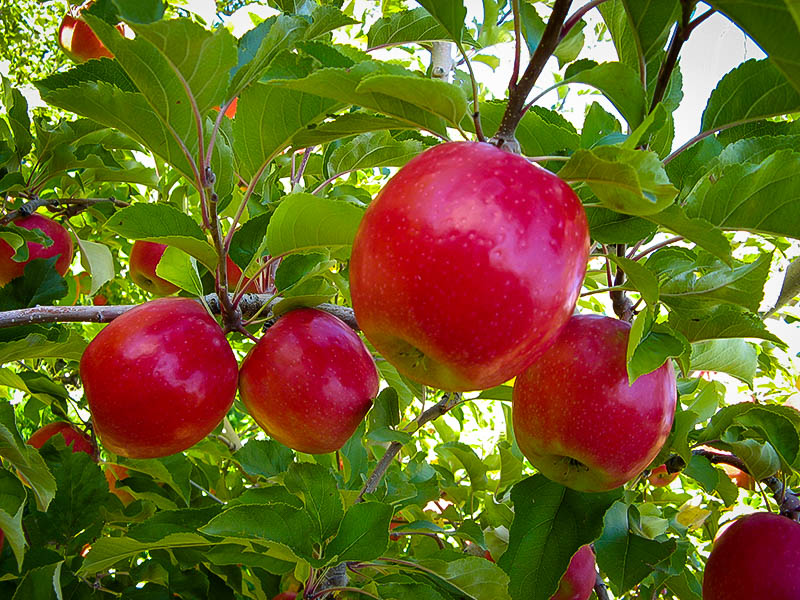 </td>
        <td>  </td>
        <td> 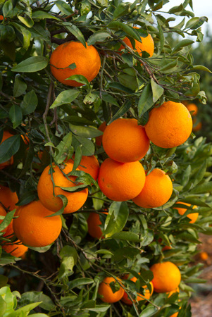 </td>
        <td>  </td>
    </tr>
</table>

#### Experiment 1 -- random thin line

由下面結果可以發現不論使哪種圖片或是方法 inpaint 過後的圖片質量皆不差。

<table width="300" border="1">
    <tr>
        <td>  </td>
        <td> 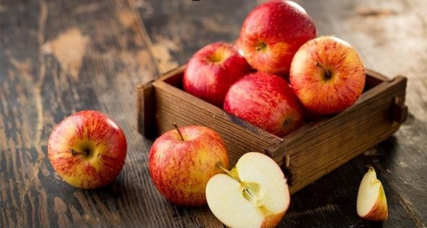 </td>
        <td> 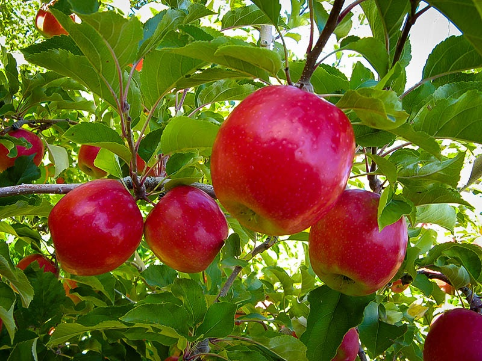 </td>
        <td>  </td>
        <td>  </td>
        <td>  </td>
        <td>  </td>
        <td>  </td>
        <td> 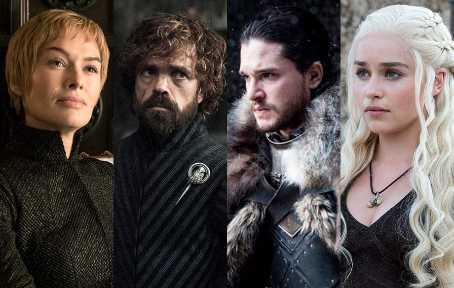 </td>
        <td>  </td>
    </tr>
</table>


#### Experiment 2 -- random thick line

由於未知的範圍增加了，相比於 Experiment 1，圖片就會有明顯類似馬賽克的 defect 或是 mask 波紋，如 face 圖片中的眼睛就不見了，但還是可以看出原本圖片的樣貌，若是周圍背景顏色較為單一，也不會與原圖相差太多。

<table width="300" border="1">
    <tr>
        <td> 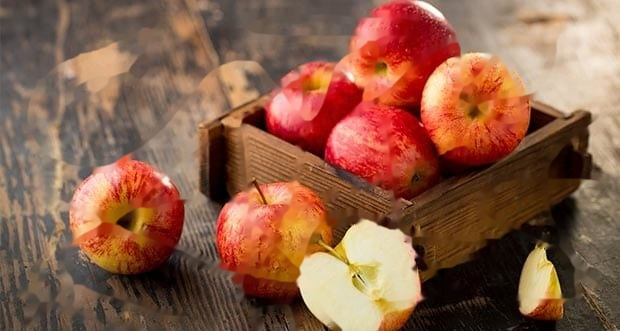 </td>
        <td> 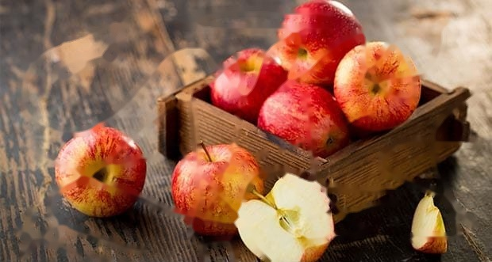 </td>
        <td>  </td>
        <td> 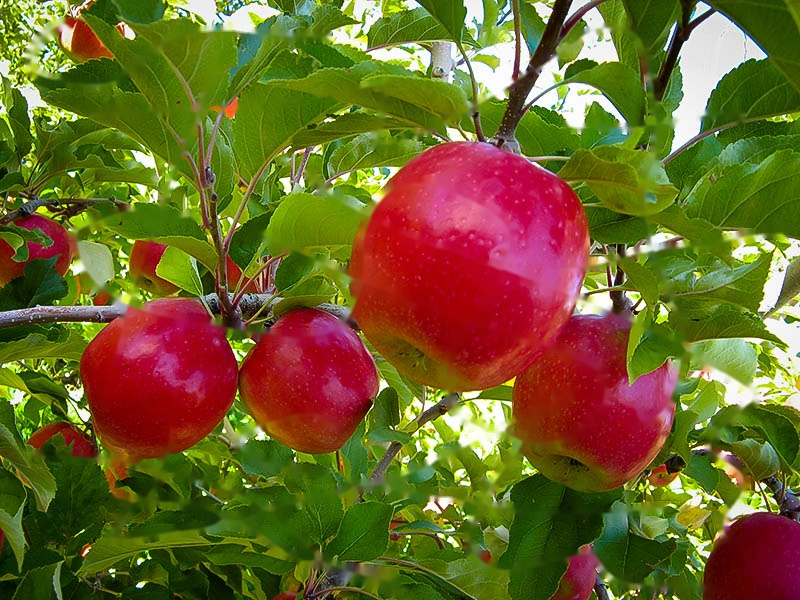 </td>
        <td>  </td>
        <td> 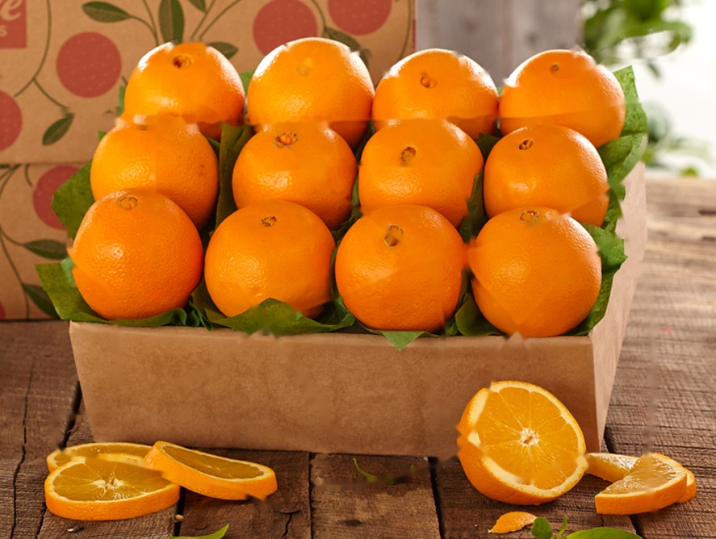 </td>
        <td>  </td>
        <td> 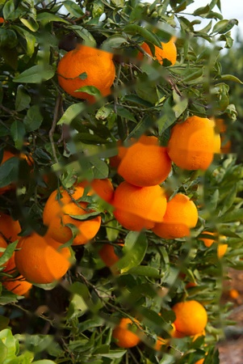 </td>
        <td>  </td>
        <td>  </td>
    </tr>
</table>

### Experiment 3 -- erase object

先前有看過 nvidia 的[影片](https://www.youtube.com/watch?v=tU484zM3pDY)，因此想做類似的實驗不出意料地，大部分的結果並不是很好，只有在被刪除的周圍顏色背景差不多時，才會有比較真實的結果，但如果是小部分不同的像素想要移除，這依然是個不錯的方法。

<table width="300" border="1">
    <tr>
        <td> 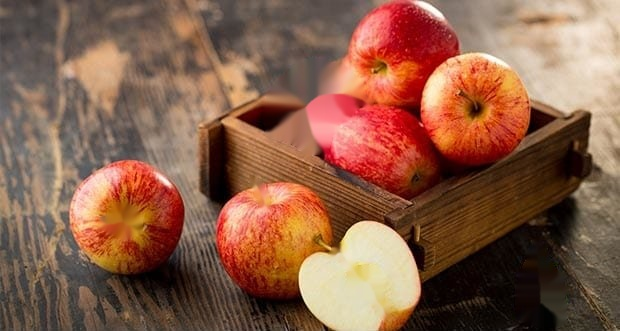 </td>
        <td>  </td>
        <td> 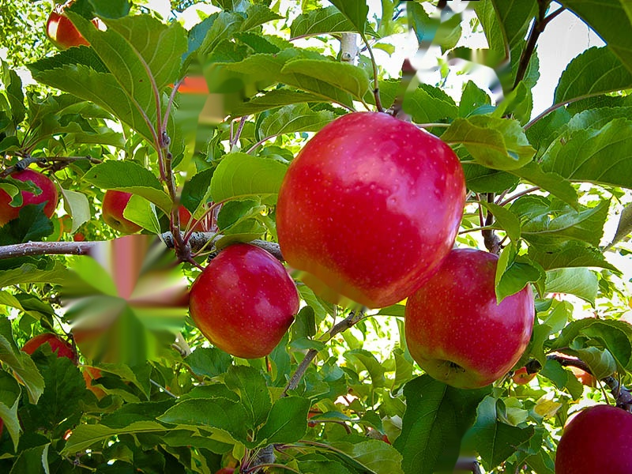 </td>
        <td> 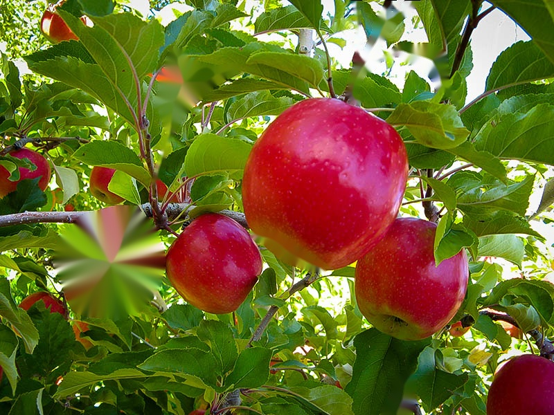 </td>
        <td>  </td>
        <td> 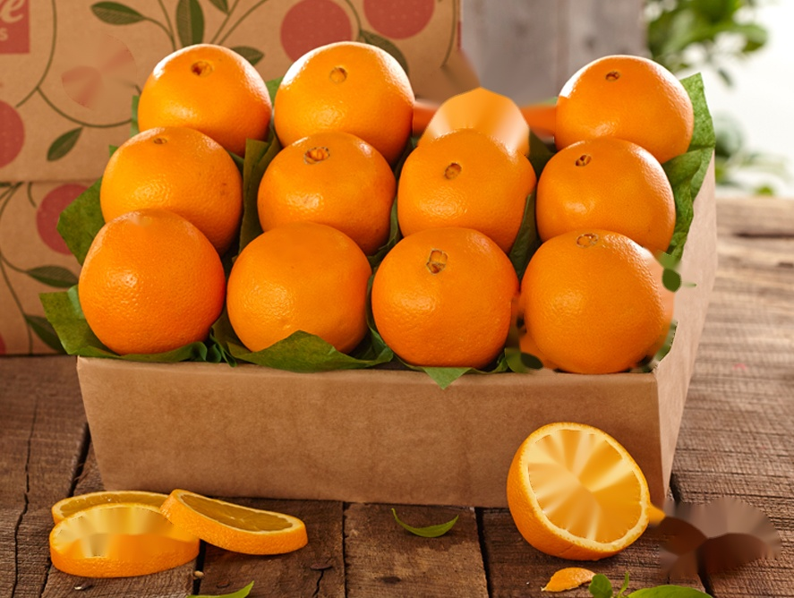 </td>
        <td>  </td>
        <td> 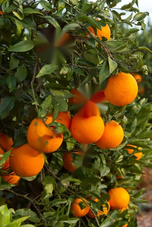 </td>
        <td>  </td>
        <td> 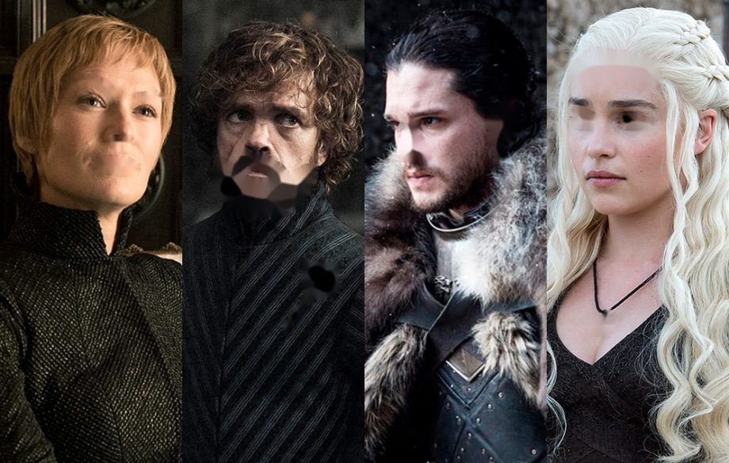 </td>
    </tr>
</table>

## Analysis
## Conclusion